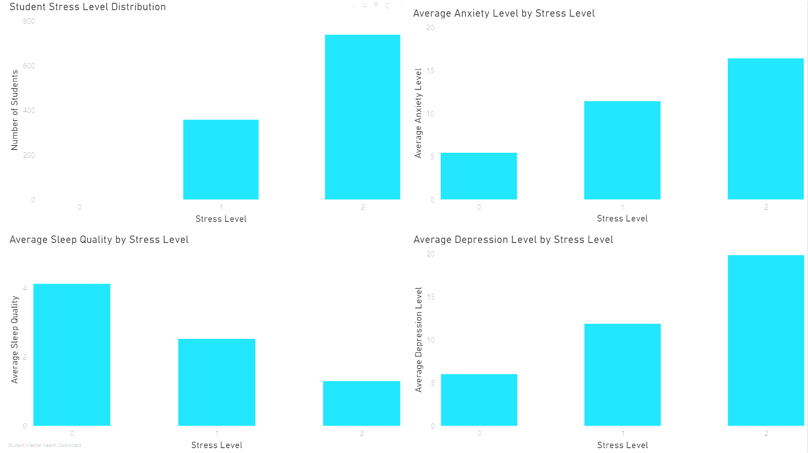
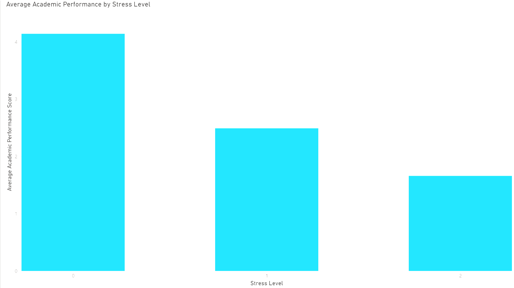

# Student Stress Analysis Dashboard

## Project Overview

This project analyzes student stress levels and their relationship with mental health and academic performance. Using Power BI, I created interactive dashboards to identify trends between stress, anxiety, depression, sleep quality, and academic achievement.

## Dataset Source

- Platform: Kaggle
- Dataset: Student Stress Monitoring Datasets
- Author: Md Sultanul Islam Ovi
- Link: https://www.kaggle.com/datasets/mdsultanulislamovi/student-stress-monitoring-datasets

This dataset includes 843 student survey responses covering anxiety, depression, sleep quality, academic performance, social support, study load, and other stress-related factors. :contentReference[oaicite:1]{index=1}

## Research Question

How do stress levels affect anxiety, depression, sleep quality, and academic performance among students?

## Dashboard Insights

- Students with higher stress levels report higher anxiety levels.
- Students with higher stress levels report higher depression levels.
- Sleep quality decreases as stress levels increase.
- Academic performance decreases as stress levels increase.

## Key Findings

- Students with higher stress levels reported higher anxiety levels.
- Depression increased as stress levels increased.
- Sleep quality decreased with higher stress levels.
- Academic performance declined as stress levels increased.

## Dashboard Preview

### Student Mental Health Dashboard

### Academic Performance Dashboard

## Tools Used

- Power BI
- SQL
- Excel
- Data Cleaning
- Data Visualization
- Exploratory Data Analysis (EDA)

## Dashboard Pages

### Page 1: Student Mental Health Dashboard

Visualizations:
- Student Stress Level Distribution
- Average Anxiety Level by Stress Level
- Average Sleep Quality by Stress Level
- Average Depression Level by Stress Level

### Page 2: Academic Performance Dashboard

Visualizations:
- Average Academic Performance by Stress Level

## Key Findings

| Metric | Relationship with Stress |
|----------|------------------------|
| Anxiety | Increases |
| Depression | Increases |
| Sleep Quality | Decreases |
| Academic Performance | Decreases |

## Skills Demonstrated

- Research Design
- Data Analysis
- Data Visualization
- Dashboard Development
- Psychological Data Interpretation
- Business Analytics Fundamentals

## Project Structure

student-stress-analysis/

├── dashboard/

├── data/

├── report/

├── sql/

└── README.md

## Career Relevance

This project demonstrates skills relevant to:

- Research Assistant positions
- Psychology Research
- Business Analytics
- MS Business Analytics (MSBA) programs
- Data Analyst internships

## Author

Tahmid Adib
